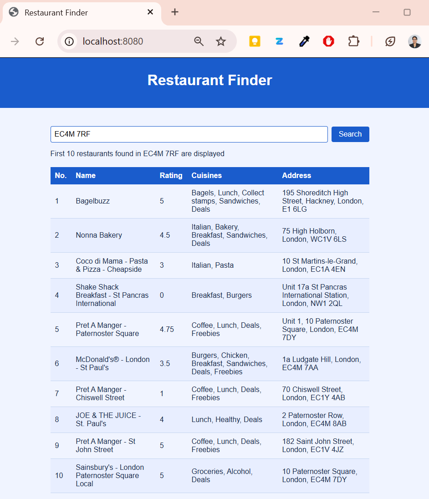
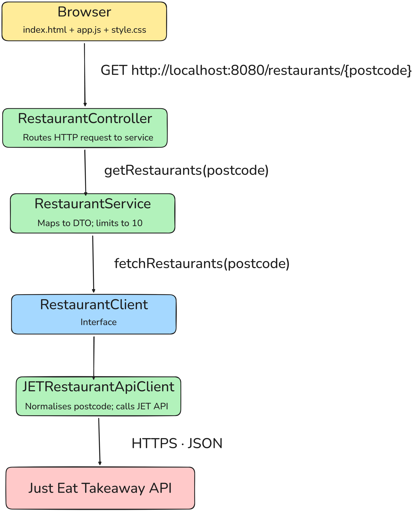

# Restaurant Finder

A Spring Boot Maven web application that fetches restaurant data from the Just Eat Takeaway (JET) API by UK postcode and displays the first 10 results in a clean web interface.

Built as part of the Just Eat Takeaway Early Careers Software Engineering Program 2026.

---

## User Story

**As a user**, I want to enter a UK postcode and see a list of the first 10 restaurants available in that area.

**Acceptance criteria:**
- Given a valid UK postcode, the application displays up to 10 restaurants
- Each restaurant shows its name, cuisines, rating (as a number), and address
- Given a postcode with no restaurants, the application shows a clear "No restaurants found." message
- Given an invalid or failed request, the application shows a meaningful error message
- Postcodes entered with or without spaces are both handled correctly

---

## Prerequisites

Verify you have the required tools installed before running the application:

```bash
java -version   # should be Java 25
mvn -version    # should be Maven 3.9+
```

If not installed:
- **Java 25** → [oracle.com/java/technologies/downloads](https://www.oracle.com/java/technologies/downloads/)
- **Maven** → [maven.apache.org/download.cgi](https://maven.apache.org/download.cgi)

---

## How to Build and Run

**1. Clone the repository:**
```bash
git clone https://github.com/sankhamalapal/Restaurant_Finder.git
```
```bash
cd Restaurant_Finder
```

**2. Build the project (compiles, runs tests, packages):**
```bash
mvn clean install
```

Expected output:
```
[INFO] Tests run: 10, Failures: 0, Errors: 0, Skipped: 0
[INFO] BUILD SUCCESS
```

**3. Run the application:**
```bash
mvn spring-boot:run
```

Expected output:
```
[INFO] Started Application in x seconds
[INFO] Restaurant Finder application started successfully.
```

**4. Open your browser and go to:**
```
http://localhost:8080
```

**5. Stop the application:**
```
Ctrl + C (on Windows, confirm with Y when prompted)
```

---

## How to Run Tests

```bash
mvn clean test
```

Expected output:
```
[INFO] Tests run: 10, Failures: 0, Errors: 0, Skipped: 0
[INFO] BUILD SUCCESS
```

To run only the service tests:
```bash
mvn test -Dtest=RestaurantServiceTest
```

---

## How to Use

1. Open your browser and go to http://localhost:8080
2. Enter a UK postcode in the search box — with or without a space (e.g. `EC4M7RF` or `EC4M 7RF`)
3. Click **Search** or press **Enter**
4. The first 10 restaurants for that postcode are displayed in a table

Example postcodes to try: `EC4M 7RF`, `CT1 2EH`, `SW1A 1AA`, `BS1 4DJ`, `M16 0RA`

**Sample result:**




**If no restaurants are found:**
```
No restaurants found.
```
**If fewer than or equal to 10 restaurants are found :**

All results are shown.

**If the API call fails:**
```
Failed to fetch restaurants. Please try again.
```

---


## REST API

The application also exposes a REST endpoint directly:

```
GET http://localhost:8080/restaurants/{postcode}
```
```
GET http://localhost:8080/restaurants/EC4M7RF
```

Example:
```bash
curl http://localhost:8080/restaurants/EC4M7RF
```

Example response (showing 2 of 10 restaurant results):
```json
{
  "restaurants": [
    {
      "name": "Curry Queen",
      "cuisines": [
        "Indian",
        "Curry",
        "Halal",
        "Deals"
      ],
      "rating": 5.0,
      "address": "1 Shenfield Street, London, N1 6SE"
    },
    {
      "name": "Mr Chan's",
      "cuisines": [
        "Chinese",
        "Asian",
        "Deals"
      ],
      "rating": 5.0,
      "address": "21 Clerkenwell Road, London, EC1M 5RD"
    }
  ],
  "total": 2341
}
```

---

## Project Structure

```
src/
├── main/
│   ├── java/dev/sankha/restaurant_finder/
│   │   ├── Application.java                  → Spring Boot entry point
│   │   ├── client/
│   │   │   ├── RestaurantClient.java          → Interface for fetching restaurants
│   │   │   └── JETRestaurantApiClient.java    → Calls the JET API
│   │   ├── controller/
│   │   │   └── RestaurantController.java      → Handles GET /restaurants/{postcode}
│   │   ├── model/
│   │   │   ├── api/                           → Raw API response models
│   │   │   │   ├── RestaurantApiResponse.java
│   │   │   │   ├── Restaurant.java
│   │   │   │   ├── Rating.java
│   │   │   │   ├── Cuisine.java
│   │   │   │   └── Address.java
│   │   │   └── dto/                           → Clean output models
│   │   │       ├── RestaurantDTO.java
│   │   │       └── RestaurantResponse.java
│   │   └── service/
│   │       └── RestaurantService.java         → Maps raw data to DTO, limits to 10
│   └── resources/
│       └── static/
│           ├── index.html                     → Web UI
│           ├── app.js                         → Fetch logic and table rendering
│           └── style.css                      → Styling
└── test/
    └── java/dev/sankha/restaurant_finder/
        └── service/
            └── RestaurantServiceTest.java     → 10 unit tests for the service layer
```

---

## Architecture

The application follows a layered architecture with clear separation of concerns:




**Key design decisions:**

**1. `RestaurantClient` interface**

The service depends on a `RestaurantClient` interface rather than directly on `JETRestaurantApiClient`. This means the service has no knowledge of HTTP or the JET API — it only knows it can ask for a list of restaurants by postcode. This makes the service fully testable without a real network call: in tests, a simple lambda acts as the stub:
```java
RestaurantClient stub = postcode -> List.of(restaurant("Pizza Place"));
```
No Mockito or additional test framework mocking is needed.

**2. Model split into `api/` and `dto/`**

The raw API response contains many fields that are not needed (e.g. `logoUrl`, `driveDistanceMeters`, `isOpenNowForDelivery`). Two separate model packages are used:
- `model/api/` — mirrors the JET API JSON structure, uses `@JsonIgnoreProperties(ignoreUnknown = true)` to safely ignore unmapped fields
- `model/dto/` — contains `RestaurantDTO` — a clean, flat record with the four required fields: name, cuisines, rating, address and `RestaurantResponse` — wraps the limited list of `RestaurantDTO` and the total count of restaurants available, enabling the frontend to display an accurate message.

This means the controller and web UI never see raw API objects — they only ever receive clean, pre-formatted data.

**3. Postcode normalisation in the API client**

Postcodes entered by the user may include spaces or lowercase letters (e.g. `ec4m 7rf`). Normalisation happens in the API client just before building the URL:
```java
postcode.strip().replace(" ", "").toUpperCase()
```
This keeps the service and controller clean — they pass the postcode through unchanged, and only the HTTP layer handles formatting for the external API.

**4. Unit tests cover the service layer only**

All business logic — mapping raw models to DTOs, extracting the star rating, joining cuisine names, formatting the address, and limiting to 10 results — lives in the service. The controller is a thin delegate with no logic of its own. Unit tests therefore target the service exclusively, keeping them fast, isolated, and meaningful. Slice tests for the controller and integration tests were considered but intentionally excluded — the requirement specified unit tests, and since all testable logic resides in the service layer, the service unit tests provide complete and sufficient coverage.

**5. Web UI served directly by Spring Boot**

Static files (`index.html`, `app.js`, `style.css`) are placed in `src/main/resources/static/`. Spring Boot serves these automatically at startup — no separate frontend server, build tool, or npm setup is required.

---

## Assumptions

- The JET API returns restaurants already filtered by postcode — no additional filtering is needed in this application.
- "First 10 restaurants" means the first 10 in the order returned by the API. The API's ordering is trusted.
- Rating is displayed as a decimal number using the `starRating` field from the API response. The review count is not displayed as the problem asked for rating as a number only.
- Address is formatted as `firstLine, city, postalCode` — this was the clearest human-readable format from the available address fields.
- Postcodes with or without spaces are both valid inputs — the application handles normalisation before the API call.
- The application assumes a valid UK postcode is entered. No format validation is applied as the requirement did not specify this. If an invalid postcode is entered, the JET API returns an empty response and the application displays "No restaurants found."

---

## Improvements

- **Rating-based sorting** — allow users to sort the restaurant list by rating (highest to lowest) using the `starRating` field from the API response.
- **Rating count** — display the number of ratings alongside the star rating (e.g. `4.5 (314 ratings)`). The `count` field is available in the API response but was excluded as the requirement specified rating as a number only.
- **Pagination** — allow the user to request results beyond the first 10 by passing a page or offset parameter.
- **Slice and Integration tests** — add slice tests for the controller to verify HTTP status codes and endpoint mapping, and an end-to-end integration test that calls the real JET API to verify the full stack works together.
- **Location-based sorting** — sort restaurants by proximity to the user's current location using the coordinates returned in `address.location.coordinates`. This would require geolocation integration and distance calculation logic.
- **Resilience** — add retry logic with exponential backoff using Spring Retry to handle transient JET API failures, and configure connection and read timeouts to prevent indefinite hanging.
---
